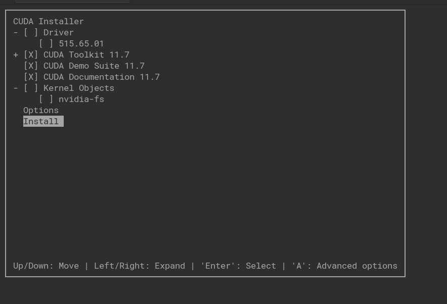

紀錄裝 Nvidia GPU driver、CUDA、CuDNN 的過程。

<!--more-->

Enviroment:
- Elementary OS 7.1 Horus
- Nvidia RTX 3060
- Kernel release: 5.15.0-58-generic

## Nvidia GPU driver

一開始蠻疑惑要裝哪個版本的，網上各種裝法都有，看到蠻多人說裝 recommand 的就好，於是我也照做，裝了推薦的 nvidia-driver-530-open 版。

```bash
$ ubuntu-drivers devices
vendor   : NVIDIA Corporation 
driver   : nvidia-driver-515 - distro non-free
driver   : nvidia-driver-530-open - distro non-free recommended
driver   : nvidia-driver-470-server - distro non-free
driver   : nvidia-driver-525-open - distro non-free
driver   : nvidia-driver-525 - distro non-free
driver   : nvidia-driver-515-open - distro non-free
driver   : nvidia-driver-530 - distro non-free
driver   : nvidia-driver-470 - distro non-free
driver   : nvidia-driver-510 - distro non-free
driver   : nvidia-driver-515-server - distro non-free
driver   : nvidia-driver-525-server - distro non-free
driver   : xserver-xorg-video-nouveau - distro free builtin
```
結果不但抓不到顯卡，連叫 nvidia-smi 還會讓 kernel 不明原因當掉...。  
說明 recommand 就只是 recommand。

最後照在 reddit 上的這篇 post: [You want to use elementary os but have a nvidia card and problems with drivers?
](https://www.reddit.com/r/elementaryos/comments/10q99ib/you_want_to_use_elementary_os_but_have_a_nvidia/) 裝了 nvidia-driver-525 版。

```bash
$ sudo su
$ sudo apt install linux-headers-$(uname -r)
$ apt-get install nvidia-driver-525
reboot
```
實測 nvidia-driver-525 有成功安裝並抓到顯卡。

```bash
+-----------------------------------------------------------------------------+
| NVIDIA-SMI 525.105.17   Driver Version: 525.105.17   CUDA Version: 12.0     |
|-------------------------------+----------------------+----------------------+
| GPU  Name        Persistence-M| Bus-Id        Disp.A | Volatile Uncorr. ECC |
| Fan  Temp  Perf  Pwr:Usage/Cap|         Memory-Usage | GPU-Util  Compute M. |
|                               |                      |               MIG M. |
|===============================+======================+======================|
|   0  NVIDIA GeForce ...  Off  | 00000000:01:00.0 Off |                  N/A |
|  0%   40C    P8    14W / 170W |      6MiB / 12288MiB |      0%      Default |
|                               |                      |                  N/A |
+-------------------------------+----------------------+----------------------+
                                                                               
+-----------------------------------------------------------------------------+
| Processes:                                                                  |
|  GPU   GI   CI        PID   Type   Process name                  GPU Memory |
|        ID   ID                                                   Usage      |
|=============================================================================|
|    0   N/A  N/A      1239      G   /usr/lib/xorg/Xorg                  4MiB |
+-----------------------------------------------------------------------------+

```

### Kernel 升級

(2024.3.7 Update)  

前陣子 kernel 升級 6.5.0-15-generic，發現 nvidia driver 動不了了。後來又發現 driver 一直編譯不成功，查了 `/var/lib/dkms/nvidia/525.147.05/build/make.log` 看到 gcc 編譯錯誤：

```bash
gcc: error: unrecognized command-line option ‘-ftrivial-auto-var-init=zero’
```

爬了文才知道是 [gcc 版本問題](https://unix.stackexchange.com/questions/766795/unrecognized-command-line-option-ftrivial-auto-var-init-zero-when-building-ke)，6.5 版 kernel 是用 gcc-12 編譯的關係，原本機器上是用 gcc-11 編譯。把 gcc 換成 gcc-12 後重新載 driver 就解決了。[參考資料](https://askubuntu.com/questions/1500017/ubuntu-22-04-default-gcc-version-does-not-match-version-that-built-latest-defaul)


## CUDA

CUDA 安裝很簡單，去[官網](https://developer.nvidia.com/cuda-toolkit-archive) 按版本抓 Runfile 下來安裝就可以了。

```bash
sudo sh cuda_12.0.1_525.85.12_linux.run 
```

設定環境變數。

```bash
export PATH="/usr/local/cuda-12.0/bin:$PATH"
export LD_LIBRARY_PATH="/usr/local/cuda-12.0/lib64:$LD_LIBRARY_PATH"
```

看有沒有抓到 nvcc。

```bash
$ nvcc -V
nvcc: NVIDIA (R) Cuda compiler driver
Copyright (c) 2005-2023 NVIDIA Corporation
Built on Fri_Jan__6_16:45:21_PST_2023
Cuda compilation tools, release 12.0, V12.0.140
Build cuda_12.0.r12.0/compiler.32267302_0
```

## CuDNN

CuDNN 我是去[官網](https://developer.nvidia.com/rdp/cudnn-download) 直接下載 tar file。
解壓之後按照 [NVIDIA cuDNN Documentation](https://docs.nvidia.com/deeplearning/cudnn/install-guide/index.html#installlinux-tar) 指示把 source 和 lib 裝到 cuda 目錄下面。 

```bash
$ sudo cp cudnn-*-archive/include/cudnn*.h /usr/local/cuda/include 
$ sudo cp -P cudnn-*-archive/lib/libcudnn* /usr/local/cuda/lib64 
$ sudo chmod a+r /usr/local/cuda/include/cudnn*.h /usr/local/cuda/lib64/libcudnn*
```

---

## CUDA 降版

最近要用 tensorflow==2.11.0 訓練模型時，被 report 找不到 `libcublas.so.11` 和其他三四個 lib，沒辦法上 GPU 訓練。心想奇怪之前明明就裝好 CUDA，怎麼會說沒有，結果把 CUDA 目錄下的 library 列出來一看，發現的確是有這個 `libcublas.so`，但卻是 `libcublas.so.12`。
好哦，所以是我裝的 CUDA 太新了，需要降版。

[Tensorflow 與適用 CUDA 的版本對照表](https://www.tensorflow.org/install/source#gpu)

降版步驟：解除安裝舊 CUDA，安裝新 CUDA

CUDA 安裝的時候自帶 uninstaller 程式，先用這個解安裝，再刪掉遺留檔案。

```bash
sudo /usr/local/cuda-12.0/bin/cuda-uninstaller
sudo rm -r /usr/local/cuda-12.0/
```

下載 CUDA 11 並安裝。

```bash
sudo sh cuda_11.7.1_515.65.01_linux.run 
```

因為本機上已經安裝了 nvidia driver，安裝 CUDA 時它會告訴你 
`Existing package manager installation of the driver found. It is strongly recommended that you remove this before continuing`，這時選擇 `continue`，在下一步把安裝 driver 的選項取消，不要安裝 driver。



安裝完訊息如下：

```
= Summary =
===========

Driver:   Not Selected
Toolkit:  Installed in /usr/local/cuda-11.7/

Please make sure that
 -   PATH includes /usr/local/cuda-11.7/bin
 -   LD_LIBRARY_PATH includes /usr/local/cuda-11.7/lib64, or, add /usr/local/cuda-11.7/lib64 to /etc/ld.so.conf and run ldconfig as root

To uninstall the CUDA Toolkit, run cuda-uninstaller in /usr/local/cuda-11.7/bin
***WARNING: Incomplete installation! This installation did not install the CUDA Driver. A driver of version at least 515.00 is required for CUDA 11.7 functionality to work.
To install the driver using this installer, run the following command, replacing <CudaInstaller> with the name of this run file:
    sudo <CudaInstaller>.run --silent --driver
```

注意到下面的 WARNING，因為在安裝的時候沒裝 driver，它告訴你 driver 版本至少要 515.00 以上才能跑，我之前裝的 driver 版本是 `525.105.17`，有超過，測試過是可以跑成功的。如果 driver 版本不對，就需要重裝 driver 了。

安裝 CuDNN 就和之前一樣去官網找對應版本下載即可。